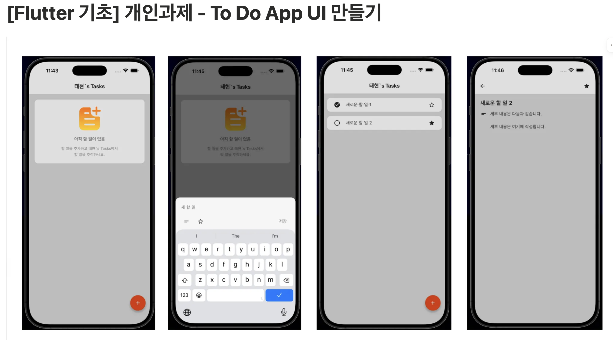
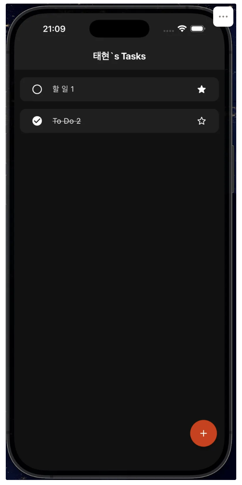

# flutter_tasks

깔끔한 **할 일 관리(ToDO)** 앱 입니다.
창업반 8기 개인과제 - TO DO APP UI 만들기

## 주요기능

**할 일 추가** - 제목과 상세내용을 입력해 새로운 할일 등록

**즐겨찾기** - 자주 사용하는 할일을 즐겨찾기 아이콘으로 등록 

**상세정보 추가** - 할일마다 별도의 상세내용 작성가능 

**다크모드 지원** - 라이트/다크 테마 자동전환 

## 과제 미리보기

 

## 트러블

**ToDoView** 사용하지 못함. 함수에 대한 이해도가 없는거 같음 

## 폴더구조

lib/

├── main.dart # 앱 진입점 

├── homepage.dart # 홈 화면 (할 일 목록 & 바텀시트 추가)

├── theme.dart # 테마

├── todo_detail_page.dart # 상세보기 페이지

└── todo_view.dart # 사용안함

## 개발자 정보

김효동 / 90년생 / 초보 개발자

